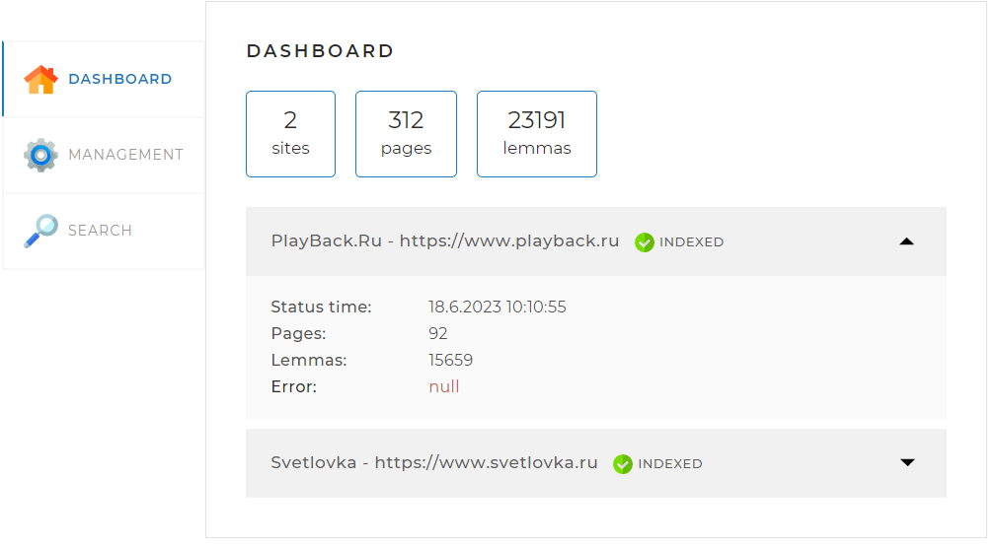
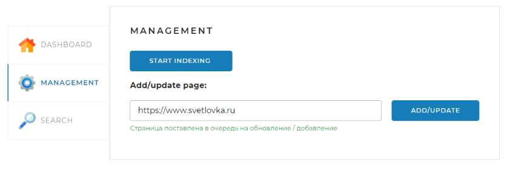
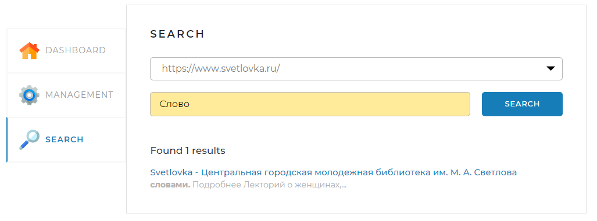

Searchengine

Данный проект реализует поисковый движок, предоставляющий пользователю специальный API со следующими основными функциями:

•  индексирование сайтов;

•  выдача основных сведений по сайтам;

•  поиск ключевых слов в проиндексированных сайтах и предоставление их пользователю.

Функции движка

В проект входит веб-страница, которая позволяет управлять процессами движка, для того чтобы на нее попасть нужно предварительно:

•  установить СУБД;

•  изменить имя пользователя и пароль в файле application.yaml;

•  в базе данных создать схему search_engine;

•  скомпилировать проект с помощью класса Application;

•  ввести в браузере http://localhost:8080/;

Страница содержит три вкладки.

Вкладка DASHBOARD

Эта вкладка открывается по стандарту. На ней отображается статистика по всем проиндексированным сайтам, в ней же можно посмотреть статистику по каждому сайту отдельно.

Вкладка MANAGEMENT

На этой вкладке находятся инструменты управления поисковым движком — запуск и остановка индексации, а также возможность обновить отдельную страницу по ссылке.

Вкладка SEARCH

Здесь находится поле поиска, а так же возможность выбрать сайт для поиска в выпадающем списке, по которому нужно будет провести поиск, а после нажатия кнопки SEARCH выводятся результаты поиска.

Используемые технологии:

Spring Framework, JPA, JSOUP, SQL, Morphology Library Lucene
 

